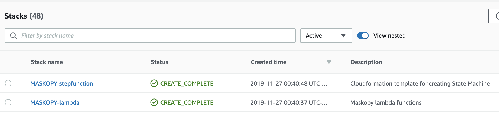

In this section, we will cover the setup that is required in the AWS accounts.

### Source Account setup

####  Step 1 : Export AWS credentials
Export AWS_ACCESS_KEY_ID and AWS_SECRET_ACCESS_KEY from source account and run in a terminal

####  Step 2 : Create KMS Key
This step creates a customer managed kms key and sets the cross account policies.
The parameters passed are exported into environment variables.
Replace the SOURCE_ACCOUNT_ID and STAGING_ACCOUNT_ID in below command to Source and Staging AWS account numbers.

```sh
./deploy/keys/deploy.sh -l LAMBDA_MASKOPY -r <AWS_REGION> -s <SOURCE_ACCOUNT_ID> -t <STAGING_ACCOUNT_ID>
```

|Option| Env Variable        | Description                                                           | Example                                         |
|------|---------------------|-----------------------------------------------------------------------|-------------------------------------------------|
| -l   | LAMBDA_ROLE_NAME    | Name of lambda execution role in staging account                      | LAMBDA_MASKOPY                                  |
| -r   | AWS_REGION          | AWS region                                                            | us-east-1                                       |
| -s   | SOURCE_ACCOUNT_ID   | AWS Source Account Number                                             | 123456789011                                    |
| -t   | STAGING_ACCOUNT_ID  | AWS Staging Account Number                                            | 123456789012                                    |


### Staging Account setup

####  Step 1 : Export AWS credentials
Export AWS_ACCESS_KEY_ID and AWS_SECRET_ACCESS_KEY from staging account and run in a terminal.

####  Step 2 : Create Security Groups
This script creates a cloudformation stack named "MASKOPY-security-group" with the json template in sg-cf.json.
The stack creates 2 SGs named MASKOPY-app and MASKOPY-db with inbound and outbound rules as mentioned in sg-cf.json.

```sh
./deploy/security_groups/deploy.sh -i 0.0.0.0/0 -r <AWS_REGION> -v <STAGING-VPC-ID>
```

|Option| Env Variable        | Description                                                                                                                                                          | Example                                         |
|------|---------------------|----------------------------------------------------------------------------------------------------------------------------------------------------------------------|-------------------------------------------------|
| -i   | CIDR_RANGE          | The lambdas assume source account role by getting temporary credentials from AWS sts. This cidr range is added to the outbound rules to establish sts connection.    | 0.0.0.0/0                                       |
| -r   | AWS_REGION          | AWS region                                                                                                                                                           | us-east-1                                       |
| -v   | VPC_ID              | AWS Staging VPC ID                                                                                                                                                   | vpc-123456                                      |


####  Step 3 : Create an ECR repository.
This script creates an ECR repo named 'maskopy'. This repo hosts the image used by fargate task that obfuscates the data.

```sh
./deploy/ecr/create_ecr.sh -r <AWS_REGION>
```

####  Step 4 : Create an sqs queue.
This queue is used by the Step Function to publish results of either success or failure.
Once the message is posted in the queue, there can be custom implementations to email the results of the execution.
Alternative implementations can publish the messages to SNS.

```sh
./deploy/sqs/create_sqs.sh -n <SQS_QUEUE_NAME> -r <AWS_REGION>
```

## Maskopy Deployment
This step builds and deploys the lambda functions and Step function to the staging environment.

#### Step 1 : Export AWS credentials.
Export AWS_ACCESS_KEY_ID and AWS_SECRET_ACCESS_KEY from staging account and run in a terminal.

#### Step 2 : Export environment variables.
Export the following environment variables into the shell. Refer to the description and examples of all the variables in the table below.

```sh
		export AWS_REGION="<AWS_REGION>"
		export CROSS_ACCOUNT_ROLE="arn:aws:iam::<SOURCE_ACCOUNT_ID>:role/Xacnt_APP_MASKOPY"
		export COST_CENTER="<COST_CENTER_FOR_BILLING>"
		export DESTINATION_ACCOUNT_ID="<SOURCE_ACCOUNT_ID>"
		export FARGATE_SECURITY_GROUP="<ID_OF_LAMBDA_SG>"
		export FARGATE_SUBNET0="<STAGING_PRIVATE_SUBNET_ID>"
		export FARGATE_SUBNET1="<STAGING_PRIVATE_SUBNET_ID>"
		export FARGATE_TASK_ROLE="<ECS_SERVICE_ROLE>"
		export LAMBDA_BUCKET_LOCATION="<S3_BUCKET_NAME>/MASKOPY"
		export LAMBDA_ROLE="LAMBDA_MASKOPY"
		export LAMBDA_SECURITY_GROUP="<ID_OF_LAMBDA_SG>"
		export LAMBDA_SUBNET_LIST="<STAGING_PRIVATE_SUBNET_ID_1,STAGING_PRIVATE_SUBNET_ID_2>"
		export ORIGINAL_KMS_KEY="arn:aws:kms:<AWS_REGION>:<STAGING_ACCOUNT_ID>:key/key_uuid"
		export RDS_SUBNET_GROUP="STAGING_RDS_SUBNET_GROUP_NAME"
		export RDS_SECURITY_GROUP="STAGING_RDS_SECURITY_GROUP"
		export SQS_NAME="<SQS_QUEUE_NAME>"
		export STAGING_ACCOUNT_ID="<STAGING_ACCOUNT_ID>"
		export STAGING_KEY="arn:aws:kms:<AWS_REGION>:<STAGING_ACCOUNT_ID>:alias/aws/rds"
```

| Env Variable                    | Description                                                                                                                                                                                    | Example                                            |
|---------------------------------|------------------------------------------------------------------------------------------------------------------------------------------------------------------------------------------------|----------------------------------------------------|
| AWS_REGION                      | aws region                                                                                                                                                                                     | us-east-1                                          |
| CROSS_ACCOUNT_ROLE              | Arn of cross account role in source account. The lambdas will be assuming this role to perform actions in Source Account. This role is passed to multiple lambda functions as an env variable. | arn:aws:iam::123456789011:role/Xacnt_APP_MASKOPY   |
| COST_CENTER                     | All the lambda functions are tagged with "Cost Center" for billing purposes                                                                                                                    | abc123                                             |
| DESTINATION_ACCOUNT_ID          | 12 digit AWS account id where the final snapshot will be copied to.                                                                                                                            | 123456789012                                                   |
| FARGATE_SECURITY_GROUP          | Security group associated to the fargate task. We have created MASKOPY-app in the above steps. Use SG-id of MASKOPY-app.                                                                       | sg-01234567891234                                                   |
| FARGATE_SUBNET0                 | Private subnet id in one availability zone to be associated to the fargate task.                                                                                                               | subnet-01234567891234                                                   |
| FARGATE_SUBNET1                 | Private subnet id in another availability zone to be associated to the fargate task.                                                                                                           | subnet-12340123456789                                                   |
| FARGATE_TASK_ROLE               | ECS Fargate role to use for running obfuscaation for Maskopy                                                                                                                                   | ECS_MASKOPY    |
| LAMBDA_BUCKET_LOCATION          | S3 bucket location where lambda code is zipped and staged.                                                                                                                                     | my-obfuscation-bucket-name/MASKOPY                                                   |
| LAMBDA_ROLE                     | Role to be associated to the lambda functions.                                                                                                                                                 | LAMBDA_MASKOPY     |
| LAMBDA_SECURITY_GROUP           | Security group associated with the lambda functions.                                                                                                                                           | sg-01234567891234    |
| LAMBDA_SUBNET_LIST              | Comma separated private subnet ids associated with the lambda functions.                                                                                                                       | subnet-01234567891234,subnet-12340123456789    |
| ORIGINAL_KMS_KEY                | Kms key arn in the source account.                                                                                                                                                             | arn:aws:kms:us-east-1:123456789011:key/00000000-1111-aaaa-bbbb-0123456789012    |
| RDS_SUBNET_GROUP                | RDS Subnet group name to be associated with the RDS in staging account.                                                                                                                        | maskopy-db-subnet                                     |
| RDS_SECURITY_GROUP              | RDS Security group to be associated with RDS in staging account.                                                                                                                               | default                                      |
| SQS_NAME                        | SQS name to publish results of the execution.                                                                                                                                                  | maskopy-queue                                      |
| STAGING_ACCOUNT_ID              | 12 digit AWS account id of the staging account.                                                                                                                                                | 123456789012                                      |
| STAGING_KEY                     | AWS managed RDS kms key in staging account.                                                                                                                                                    | arn:aws:kms:us-east-1:123456789012:alias/aws/rds                                      |

#### Step 3 : Build and deploy lambda functions and step function.
This script builds the lambda functions with python3 using requirements.txt and zips the lambda artifacts.
The artifacts are copied to S3 bucket and pulled during lambda execution. The script then deploys the lambdas and step function state machine.

```sh
./deploy/deploy.sh
```
At the end of the deployment, you would see two cloudformation stacks created in the Staging account.

Cloudformation stack name:
- MASKOPY-stepfunction
- MASKOPY-lambda

[](images/cfn.png)